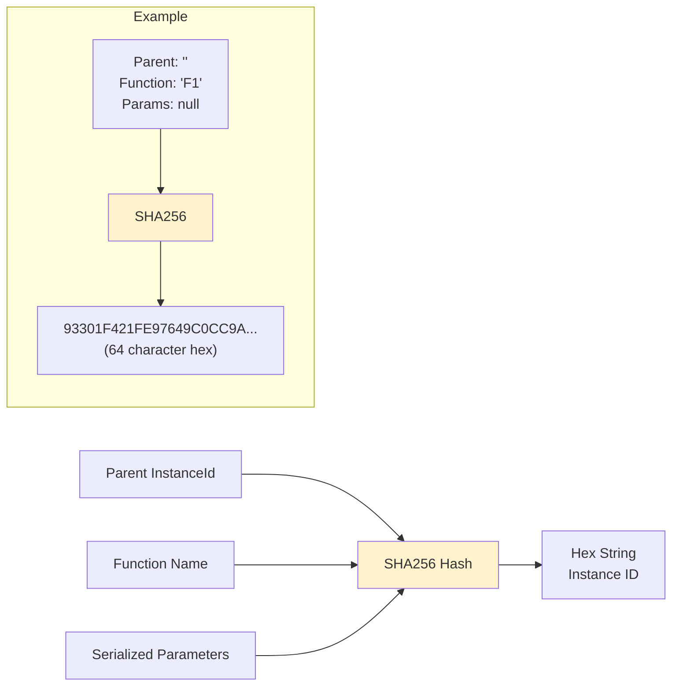
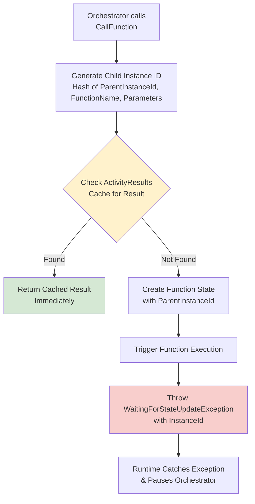
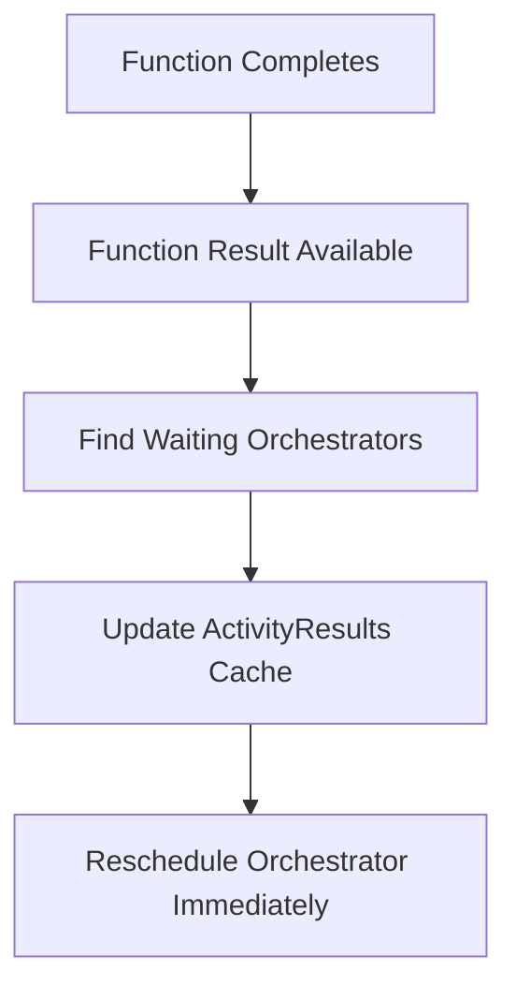
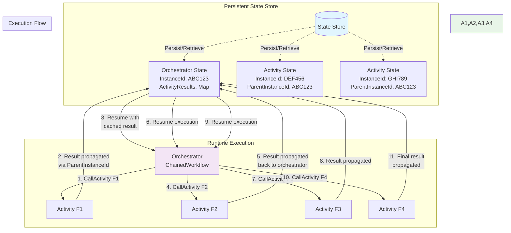
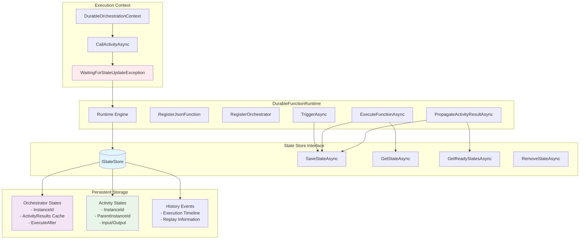

# Asynkron.DurableFunctions Vocabulary

This document describes the key concepts and components in the function call state foundation and how they work together
to enable idempotent activity invocation in durable orchestrations.

## Core Concepts

### Orchestrator

A durable function that coordinates the execution of activities and manages workflow state. Orchestrators can pause and
resume execution, making them resilient to failures and restarts.

### Activity

A unit of work that performs a specific task within an orchestration. Functions are idempotent and can be retried
safely without side effects. Invoked using **CallFunction**.

### Durable Function State

The persistent state of a function that includes execution timing, input data, and cached activity results. This state
survives across process restarts and enables replay scenarios.

## Function Call State Foundation Components

### Instance ID

A unique, deterministic identifier generated from `[orchestratorStateInstanceId, activityName, parameters]`. This ID
ensures that the same activity call with the same parameters always produces the same identifier, enabling idempotent
execution.

```csharp
// Example: Calling F1 with null parameters from a specific orchestrator state
// Always generates the same hash: "93301F421FE97649C0CC9A426EF6F6450D949D9B431312079097D1154B0F6709"
var instanceId = DurableFunctionState.GenerateChildInstanceId(stateInstanceId, "F1", null);
```

### Activity Results Cache

A dictionary stored in `DurableFunctionState.ActivityResults` that maps instance IDs to their corresponding results.
This cache enables functions called via **CallFunction** to return immediately on subsequent calls without re-execution.

```csharp
// Structure: Dictionary<InstanceId, SerializedResult>
state.ActivityResults["93301F..."] = ""Result from F1""; // JSON serialized
```

### WaitingForStateUpdateException

A special exception thrown by orchestrators when they need to wait for a function result that isn't yet available. This
exception triggers the runtime to pause the orchestrator and reschedule it for later execution.

```csharp
// Thrown when activity result is not cached
throw new WaitingForStateUpdateException(instanceId);
```

### Parent Instance ID

A reference stored in function state that points back to the orchestrator invocation that triggered the function. This
enables result propagation back to the waiting orchestrator.

```csharp
// Activity state tracks which orchestrator is waiting for its result
activityState.ParentInstanceId = orchestratorInstanceId;
```

### Instance ID Generation Process

The system uses SHA256 hashing to generate deterministic instance IDs that ensure idempotent execution:



The `GenerateChildInstanceId` method ensures that:

- Same inputs always produce same ID (deterministic)
- Different inputs produce different IDs (unique)
- Parent-child relationships are maintained through the parent instance ID

## How Components Work Together

### 1. Function Invocation Flow



### 2. Orchestrator Pause-Resume Cycle

```mermaid
flowchart TD
    A[WaitingForStateUpdateException<br/>Thrown] --> B[Runtime Catches Exception<br/>& Extracts InstanceId]
    B --> C[Reschedule Orchestrator<br/>for Future Execution]
    C --> D[Function Execution<br/>Continues Independently]
    D --> E[Function Completes<br/>& Result Available]
    E --> F[PropagateActivityResultAsync<br/>Called]
    F --> G[Scan All Orchestrator States<br/>for Matching ParentInstanceId]
    G --> H[Update ActivityResults&#91;InstanceId&#93;<br/>with JSON Result]
    H --> I[Reschedule Orchestrator<br/>to Run Immediately]
    I --> J[Orchestrator Re-executed<br/>from Last State]
    J --> K{Check ActivityResults<br/>Cache Again}
    K -->|Found| L[Resume with Cached Result<br/>Continue Execution]
    K -->|Not Found| M[Wait for More Results]
    
    style A fill:#f8cecc
    style E fill:#d5e8d4
    style L fill:#d5e8d4
```



### 3. Function Result Propagation



### 4. Complete Function Interaction via Persistent State Store



## Practical Example: Chained Function Workflow

Here's a practical example showing how a chained function workflow interacts with the persistent state store:

```csharp
// Orchestrator function that demonstrates the complete pattern
public static async Task<string> ChainedWorkflow(IDurableOrchestrationContext context)
{
    try
    {
        // Each CallFunction call generates a unique instance ID and checks cache
        var x = await context.CallFunction<string>("F1", null);
        var y = await context.CallFunction<string>("F2", x);
        var z = await context.CallFunction<string>("F3", y);
        return await context.CallFunction<string>("F4", z);
    }
    catch (Exception ex)
    {
        // Error handling or compensation logic
        return $"Failed: {ex.Message}";
    }
}
```

### Execution Timeline

```mermaid
gantt
    title Durable Function Execution Timeline
    dateFormat X
    axisFormat %L
    
    section Orchestrator
    Start Orchestration    :0, 1
    Wait for F1           :1, 3
    Resume & Call F2      :3, 4
    Wait for F2           :4, 6
    Resume & Call F3      :6, 7
    Wait for F3           :7, 9
    Resume & Call F4      :9, 10
    Wait for F4           :10, 12
    Complete              :12, 13
    
    section Activities
    F1 Execution          :2, 3
    F2 Execution          :5, 6
    F3 Execution          :8, 9
    F4 Execution          :11, 12
```



### State Store Interactions

During this workflow, the state store maintains:

1. **Orchestrator State**: Contains the execution timeline and function results cache
2. **Function States**: Each function maintains a reference back to the orchestrator
3. **Result Propagation**: Completed functions update the orchestrator's cache and trigger resumption

This architecture enables:

- **Resilience**: Process crashes don't lose progress
- **Scalability**: Orchestrators don't block threads while waiting
- **Consistency**: Replay guarantees deterministic execution

## Key Patterns

### Idempotent Function Pattern

Functions with the same instance ID are never executed more than once. The system automatically returns cached results
for repeated calls using **CallFunction**.

### Deterministic Replay

Orchestrators can be replayed from any point in their execution history because all function results are cached and
deterministically retrieved via **CallFunction**.

### Asynchronous Coordination

Orchestrators don't block waiting for functions. Instead, they pause execution and resume when results become
available, allowing the runtime to process other work.

## State Store Architecture

The persistent state store is the central component that enables function coordination and recovery. Here's how the
different components interact with it:



## State Persistence

### DurableFunctionState Properties

- `ExecuteAfter`: When the function should next run
- `InstanceId`: Hash-based identifier for the function state
- `FunctionName`: Name of the function to be executed
- `Input`: Serialized input parameters as JSON
- `ActivityResults`: Dictionary of cached activity results keyed by instance ID
- `ParentInstanceId`: Reference to parent orchestrator (for activities)
- `HistoryEvents`: List of execution history events for replay scenarios

### State Store Interface

The `IStateStore` provides persistence operations:

- `SaveStateAsync()`: Persist function state
- `GetStateAsync()`: Retrieve function state by ID
- `GetReadyStatesAsync()`: Find functions ready for execution
- `RemoveStateAsync()`: Clean up completed functions

## Error Handling

### WaitingForStateUpdateException

- **Purpose**: Signal that orchestrator needs to wait for activity completion
- **Handling**: Runtime reschedules orchestrator for future execution
- **Recovery**: Orchestrator resumes when activity result becomes available

### Function Failures

Function failures are propagated back to orchestrators as normal exceptions, allowing orchestrators to implement
compensation logic or retry patterns.

## Performance Considerations

### Memory Efficiency

- Function results are stored as JSON strings to minimize memory usage
- Instance IDs use SHA256 for uniqueness while maintaining reasonable size
- Completed orchestrations are automatically cleaned up from state storage

### Execution Efficiency

- Cached results eliminate redundant function executions
- Orchestrator pause-resume minimizes resource usage while waiting
- Result propagation enables immediate orchestrator resumption

This vocabulary provides the foundation for understanding how the function call state system enables reliable,
efficient, and scalable durable orchestrations.
